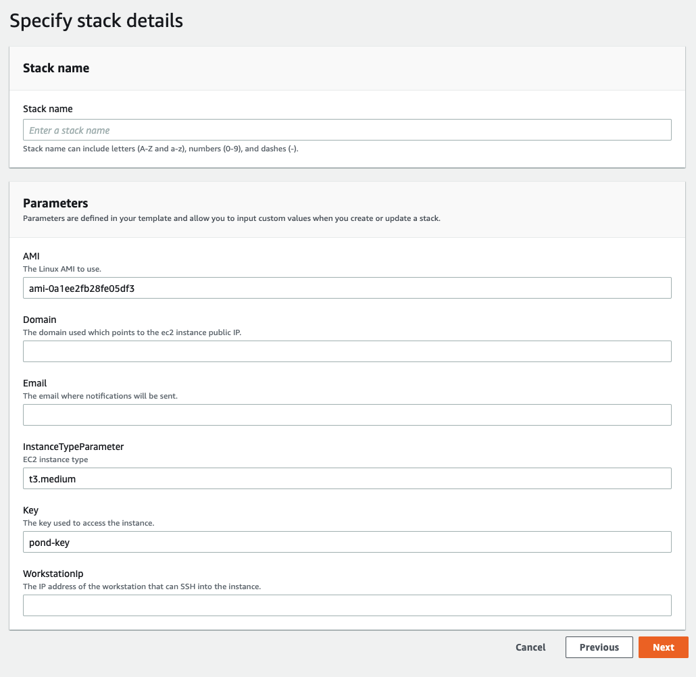

# AWS Cloudformation Pond Deploy

## Prerequisites

- You should have an [AWS account](https://aws.amazon.com/resources/create-account/).
- AWS Access to Cloudformation in eu-central-1.
- Create an [AWS Key pair](https://docs.aws.amazon.com/ground-station/latest/ug/create-ec2-ssh-key-pair.html) to connect to the Pond EC2 instance.

## Deployment

Follow thse steps to deploy the Cloudformation template on AWS.
1. To deploy a Cloudformation template on AWS click on this [link](https://shorturl.at/bnoRS).
2. Specify the stack paramters as shown in the 
3. Point your DNS to the EC2 instance's public IP
4. Enjoy Pond!

## Troubleshooting

The AWS Cloudformation deployment takes around 1 hour.

The deployment is done only when the the Cloud formation status is Completed.

In case the deployment takes longer than 90 min you can check the init logs on the Pond EC2 instance:

```sudo less /var/log/cloud-init-output.log```

Usually if the Cloudformation is deployed properly you should see the following when tailing the file ```/var/log/cloud-init-output.log```

```
Adding Pond overlay network
Creating Pond local Network
b0b97bfd0a17c932d6237ec477e291ce4a0ef15199e750bfaf7f3892bc0aa9e0
Pond starting..
Cloud-init v. 19.3-45.amzn2 finished at Fri, 22 Jul 2022 12:04:47 +0000. Datasource DataSourceEc2.  Up 3866.46 seconds
```
